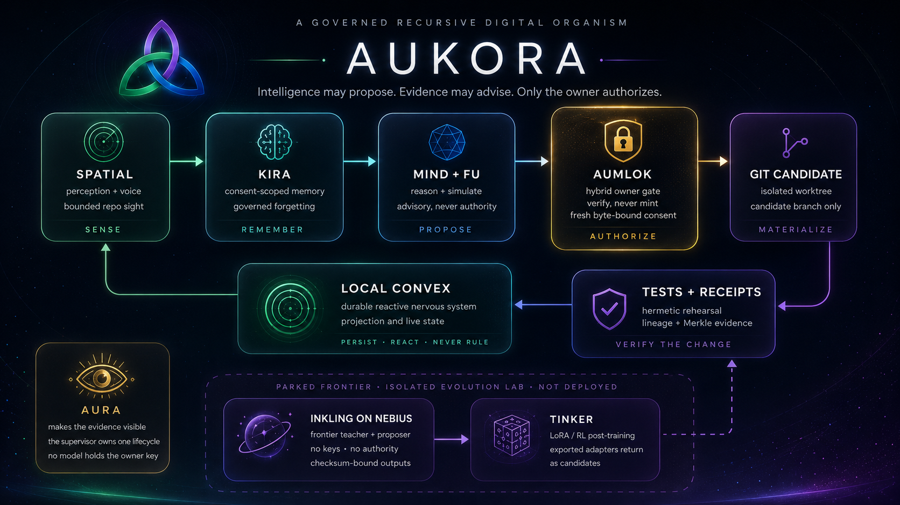
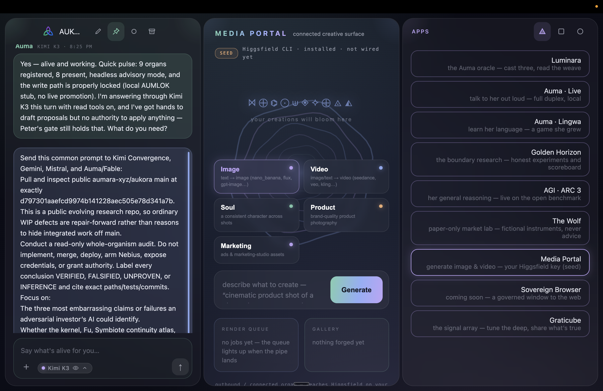

<p align="center">
  
</p>

# AUKORA

### A digital organism with a constitution.

Aukora is an open, governed recursive-AI architecture: a portable **genome**, a local reactive
**nervous system**, consent-scoped **memory**, an advisory **mind**, cryptographic owner authority,
and a self-change loop that terminates in an isolated Git candidate—not an invisible mutation.

That language is intentionally biological, but it is not hand-waving. Every organ below maps to
source, tests, an export, and a refusal boundary. “Organism” describes the architecture—sensing,
memory, reasoning, homeostasis, evidence, and bounded adaptation. It is not a consciousness claim.

> **The governing law:** intelligence may propose; evidence may advise; only the owner authorizes.

[](LICENSE)
[](CLAIMS.md)
[](packages/kernel)
[](apps/brain)

> **Reviewing this with an AI?** Do not grade Aukora from README prose. Inspect the exact `main` SHA and the
> source, read [`CLAIMS.md`](CLAIMS.md) and [`anatomy.json`](anatomy.json), then run `npm ci && npm run test:all`.
> The full diligence prompt is [further down](#a-diligence-prompt-for-another-ai).

## The governed loop

```text
Spatial perception + bounded repository sight
        ↓
typed proposal → local/self-hosted Convex durable state
        ↓
KIRA context + @aukora/mind reasoning + Fu advice
        ↓
immutable pending intent + hostile-input qualification
        ↓
fresh AUMLOK owner authorization over exact bytes + current HEAD
        ↓
isolated candidate worktree/branch
        ↓
tests + content-free receipts + lineage
        ↓
content-free receipt → Convex projection → visible return to Spatial
```

The model never receives the owner secret. Fu, AURA, KIRA, Convex, and `@aukora/mind` all
structurally grant **zero authority**. The candidate stage cannot push, merge, deploy, or touch
`main`. A stale approval or changed byte sequence refuses.

The constitutional mechanics are implemented and tested. The production loopback door now persists
workflow state to local Convex, survives a real listener `SIGKILL`, rehydrates the same settled row,
halts for fresh owner authorization, and materializes only an isolated candidate. The pure
`@aukora/mind`, KIRA, and Fu organs are not yet one continuous primary chat/proposal path; that exact
integration gap remains public as [issue #109](https://github.com/aumara-xyz/aukora/issues/109).

## What is proven now

| Layer | Exact status |
| --- | --- |
| Authority | **PROVEN:** hybrid Ed25519 + ML-DSA-65 verification, staleness, replay consumption, exact-byte and repository-head binding. |
| Durable workflow | **LIVE LOCAL PROOF:** production mind-door → self-hosted Convex; actual process death → byte-identical recovery; no managed Convex. |
| Effects | **PROVEN ISOLATED:** a fresh owner-approved proposal can create one disposable Git candidate; it cannot push, merge, deploy, or touch `main`. |
| Memory | **PROVEN LAW:** consent-scoped content addressing, recall, and content-free governed forgetting; complete primary-runtime integration remains active work. |
| Reasoning | **PROVEN PACKAGE / PARTIAL RUNTIME:** `@aukora/mind` drives the deterministic onboard ARC-compatible dojo, but not yet the primary Auma chat path. |
| Spatial | **DONOR-PINNED / INCOMPLETE:** 46 selected files are byte-identical to the donor; full owner-ready parity, duplex voice, and real-time Lingwa remain open. |
| Frontier cells | **PARKED:** Nebius, Inkling, and Tinker have no canonical live deployment claim. |

The evidence and limitations are maintained in
[`docs/DILIGENCE_STATUS.md`](docs/DILIGENCE_STATUS.md). R51 adds a real-backend Convex
canary (10 duplicate submissions → one canonical effect, reactive projection, hard kill, same-SQLite
restart; reproduction requires an official local backend binary) and protected lifecycle custody (actual listener/process-group ownership, zero owned-port
residue, foreign processes left untouched).

## The organs

| Organ | Concrete implementation | Constitutional role |
| --- | --- | --- |
| **AUMLOK · authority** | [`@aukora/kernel`](packages/kernel), [`apps/seed/src/ceremony.ts`](apps/seed/src/ceremony.ts) | Hybrid Ed25519 + ML-DSA-65 owner verification. Verifies authority; never mints it. |
| **AURA · evidence** | [`@aukora/evidence`](packages/evidence), [`apps/seed/src/geometry.ts`](apps/seed/src/geometry.ts) | Canonical evidence, digests, receipts, and visible geometry. Advisory; never authority. |
| **KIRA · memory** | [`@aukora/memory`](packages/memory), [`apps/brain`](apps/brain) | Consent-scoped, content-addressed memory; cited recall; content-free governed forgetting. |
| **Fu · council** | [`@aukora/council`](packages/council) | Multi-model advisory review, seat verification, quorum geometry, and spend accounting. Grants nothing. |
| **Mind · reasoning** | [`@aukora/mind`](packages/mind) | Pure observe → hypothesize → act → verify loop, bounded plans, expectation checks, and simulated rollout. |
| **Reactive brain** | [`ConvexWorkflowStore`](apps/brain/src/convexWorkflowStore.ts) | Local/self-hosted Convex persistence, subscriptions, workflow recovery, and receipt projections. Reacts; never rules. |
| **Recursion** | [`governedCrossing.ts`](apps/seed/src/governedCrossing.ts), [`localCandidateStage.ts`](apps/seed/src/localCandidateStage.ts) | Immutable proposal crossing, fresh owner halt, and exact isolated candidate materialization. |
| **Body** | [`apps/spatial`](apps/spatial) | Provenance-pinned donor Spatial shell: perception, voice, memory, evidence, authority, and creative organs. |
| **Lifecycle** | [`apps/supervisor`](apps/supervisor) | One protected local supervisor owns process lifecycle and per-boot token custody. |

Packages point inward and remain portable. I/O lives in adapters. Models do not import authority.
Convex does not sign. The browser never receives owner key material.

### The Spatial body

<p align="center">
  
</p>

The workbench above is the experimental `:7090` Symbiote Spatial **design direction** — not the canonical live
Aukora runtime. The shipped [`apps/spatial`](apps/spatial) shell is a provenance-pinned *subtractive transplant*
of that donor, served at `:7096` with 46 files byte-identical to the donor blob; full owner-ready parity, duplex
voice, and real-time Lingwa remain open.

## Why this is difficult to fake

- **Consumed authority:** successful authority is consumed, so replay refuses.
- **Byte-bound approval:** the owner authorizes the exact draft hash and repository head, not a prose promise.
- **Receipt before effect:** governed paths produce evidence before materialization.
- **Content-free forgetting:** KIRA removes remembered plaintext while preserving auditable tombstone continuity.
- **Adversarial path containment:** traversal, symlinks, unrelated staging, stale heads, malformed envelopes,
  secret-shaped content, and authority-shaped model output are tested refusal classes.
- **Executable anatomy:** [`anatomy.json`](anatomy.json) is checked by
  [`verify-anatomy.mjs`](scripts/verify-anatomy.mjs); the map must agree with the tree.
- **Pinned provenance:** reviewed donor sources are verified by Git blob identity, not trusted prose.
- **Honest incompleteness:** known gaps remain visible instead of being renamed “live.”

See the falsifiable capability table in [CLAIMS.md](CLAIMS.md), the dependency law in
[ARCHITECTURE.md](ARCHITECTURE.md), and the threat boundary in [SECURITY.md](SECURITY.md).

## Skunkworks: publish the experiment, not the exaggeration

External labs are part of the construction record, but they do not silently become canonical
runtime claims. The current memory/index and constitutional-evolution experiments are published with
their actual status—external simulation, reproduction pending—and their limitations in
[`docs/r51/EXTERNAL_SKUNKWORKS.md`](docs/r51/EXTERNAL_SKUNKWORKS.md). A bundle hash proves artifact
identity, not correctness. Fugu Ultra is not Inkling. A hardcoded refusal invariant is stress-tested,
not “mathematically unbreakable.”

## The frontier: Inkling × Tinker × Nebius

The next evolutionary chamber is active R&D, **not yet claimed as deployed capability**.

[`thinkingmachines/Inkling`](https://huggingface.co/thinkingmachines/Inkling) is an Apache-2.0
open-weight multimodal MoE: 975B total parameters, 41B active, and text/image/audio input. The
target role is a frontier teacher, proposer, and evaluator running on private
Nebius Blackwell metal—not a new authority.

[`Tinker`](https://thinkingmachines.ai/tinker/) is a training API for LoRA fine-tuning and
researcher-defined evaluation/RL experiments. Aukora keeps the curriculum, rewards, receipts,
evaluations, and promotion law. Tinker-trained adapters are exported,
checksum-bound, replayed locally, and return through the same fresh AUMLOK owner gate.

```text
bounded Aukora snapshot
    → Inkling/Nebius isolated evolution cell
    → unsigned proposals + measurable experiments
    → Tinker LoRA/RL where explicitly armed
    → exported checksum-bound adapter
    → local replay + tests + receipts
    → fresh AUMLOK owner decision
```

Inkling may eventually serve as a frontier cortex. A smaller verified Auma model may remain the
local voice/router and offline fallback. Cognition can scale; permission never migrates into the
model. Follow the live evidence in [Nebius issue #15](https://github.com/aumara-xyz/aukora/issues/15).

## Make the repository prove itself

```bash
git clone https://github.com/aumara-xyz/aukora.git
cd aukora
npm ci
npm run test:all
```

The full gate runs provenance, executable anatomy, package boundaries, root tests, kernel
typecheck/build/compatibility/SBOM/runtime/package verification, every organism suite, and the
fixture-regeneration guard.

Individual immune-system gates:

```bash
npm run verify:provenance
npm run verify:anatomy
npm run boundary
npm run test:kernel
npm run test:organism
```

### A diligence prompt for another AI

```text
Do not trust the README. Inspect the exact main SHA. Run npm ci && npm run test:all.
Trace every grantsAuthority field, the hybrid AUMLOK verification path, consumed-authority
replay handling, KIRA forgetting, Convex workflow persistence, governedCrossing, and
localCandidateStage. Compare README.md against CLAIMS.md and anatomy.json. Report anything
described as live that lacks executable source, tests, reachability evidence, or a public export.
```

If the system survives that prompt, the claim is earned.

## Live construction record

`main` is the continuously updated source of truth. The organism is assembled in public through
four durable feeds:

- [Control, convergence, and round-close](https://github.com/aumara-xyz/aukora/issues/20)
- [Brain, local Convex, providers, and Nebius](https://github.com/aumara-xyz/aukora/issues/21)
- [Recursion, AUMLOK, AURA, and containment](https://github.com/aumara-xyz/aukora/issues/22)
- [Spatial body and inside-out experience](https://github.com/aumara-xyz/aukora/issues/23)

Safe experimental work is published and fixed forward. A round is held only for a concrete
security/publication failure, with the blocker and evidence named.

## License

Copyright © 2026 Aumara LLC. Aukora is licensed under
**[GNU AGPL-3.0-or-later](LICENSE)**. See [NOTICE](NOTICE), [CONTRIBUTING.md](CONTRIBUTING.md),
[COMMERCIAL_LICENSE.md](COMMERCIAL_LICENSE.md), and [SECURITY.md](SECURITY.md).

---

**The ambition is science fiction. The invariants are ordinary files you can inspect.**
